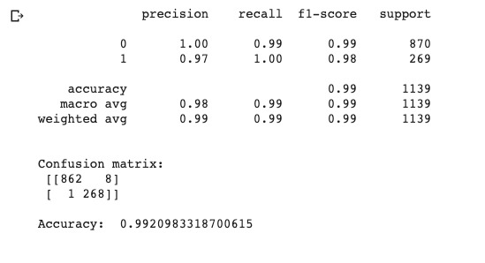

# Spam-Classification-Using-Naive-Bayes-Model
Using an Scikit-Learn Naive Bayes Model, was able to train a sequential dataset to process the textual data to identify whether the message is spam or not with an accuracy of 99%. Able to apply this classifier into messaging platforms outside of the scope of emails.

## Results

After training this classifier using a Naive-Bayes Model, the results were: 

The **F1 Score** is an indication of the model's accuracy taking into account precision and recall. 

With a **F1 Score** of 0.99, it is an indication of a well built model.
